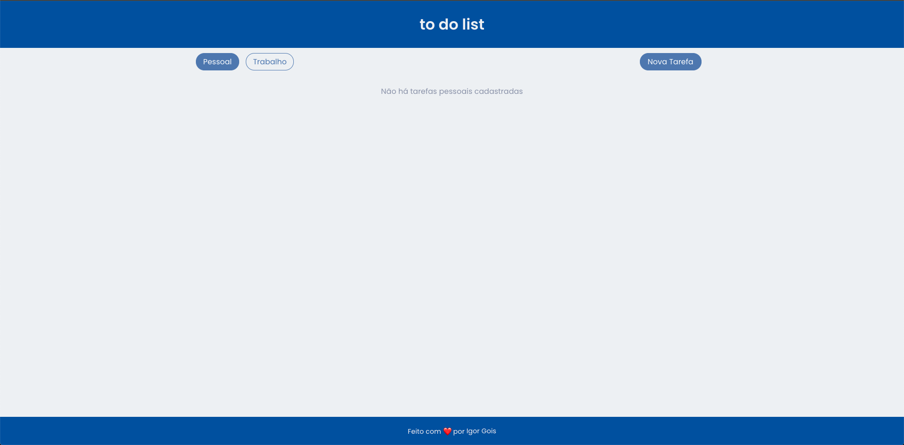
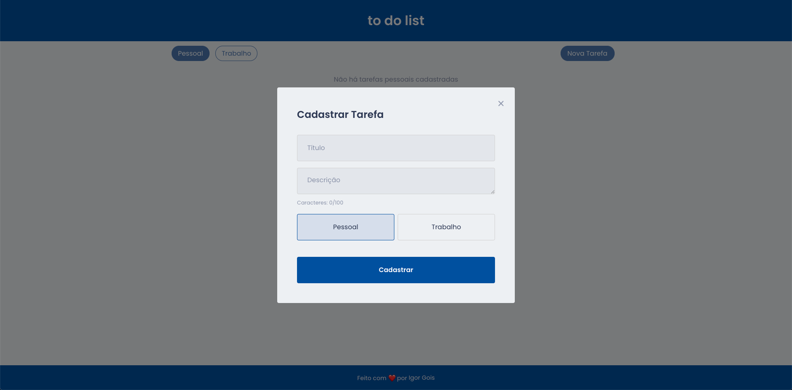
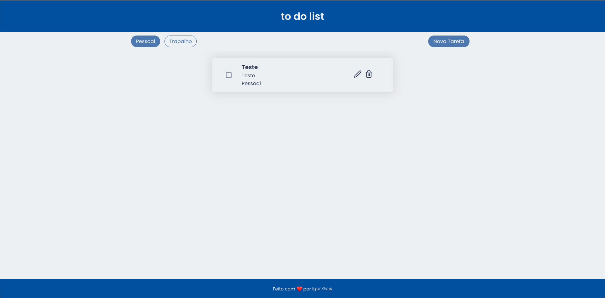
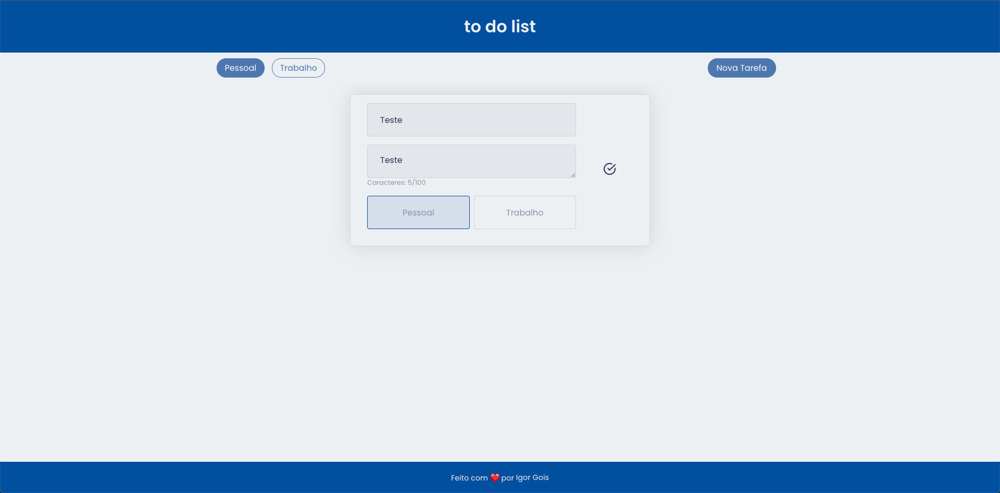

# Desafio ReactJS - To Do List

## Objetivo:
Criar um TO DO app para criar tarefas com duas categorias distintas, Pessoal e Profissional. Existe duas listas dinstintas que listam as atividades por categoria, é possível criar uma tarefa, editar a tarefa e apagar.

* Criar Tarefa:
  * Clique no botão "Nova Tarefa" e preencha os campos no modal. Coloque o título, a descrição que é limitado à 100 caracteres, escolha a categoria e clice em "Cadastrar".
* Editar Tarefa: 
  * Clique duas vezes no card da tarefa ou clique no ícone para editar a tarefa. Faça suas alterações e pressione enter ou clique no botão
   para finalizar.
* Deletar Tarefa:
  * Clique no botão da lixeira para excluir a tarefa.

## Ferramentas
____
* **_ReactJS_**
* **_Redux_**
* **_ImmerJS_**
* **_Styled Components_**

## Para executar o app:

+ Clone o projeto:
~~~Bash
git clone https://github.com/igorgoiis/teste-foursales.git
~~~

+ Acesse a pasta do projeto
~~~Bash
cd ./teste-foursales
~~~

+ Instale as dependências do projeto
~~~Bash
# utilizando Yarn
yarn

# utilizando npm
npm install
~~~

+ Execute o projeto
~~~Bash
yarn start
~~~

## Prints do app:

